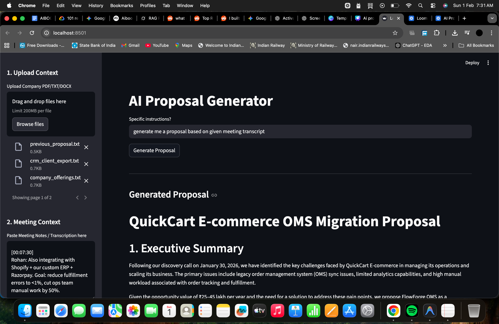
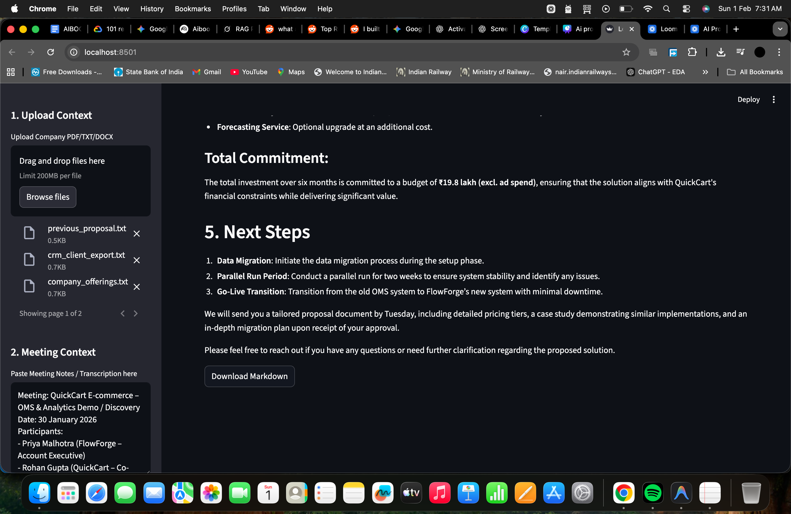

# AI Proposal Generator  


### What problem we’re trying to solve
Sales proposals are built using CTRL+C, CTRL+V, and hope.

Data is scattered across tools, leading to slow and inconsistent proposals.

By the time everything is stitched together, deal momentum is already lost.

---

### Our solution
We are building Proposal Generator. It’s built for busy B2B sales reps, account executives, and founders who want to go from discovery call/client meeting to client-ready proposal in minutes not hours.

---

## ✨ Features

- Fully **local** execution (no OpenAI / Anthropic / cloud dependency)
- Uses lightweight **Ollama** model (`granite4:1b` or any model you prefer)
- Embeds documents with fast & compact **all-MiniLM-L6-v2**
- Persistent vector storage with **Chroma**
- Supports **PDF, DOCX, TXT** company files
- Streamlit interface — simple drag & drop + paste meeting notes
- Custom instructions field (e.g. "emphasize ROI", "focus on sustainability")
- Outputs clean **Markdown** proposal with standard B2B structure
- One-click download of generated proposal

## Proposal Structure (fixed)

```markdown
# Proposal

1. Executive Summary
2. Understanding Your Needs
3. Proposed Solution
4. Pricing & Packages
5. Next Steps
```

## Tech Stack

| Component          | Technology                                   | Notes                              |
|--------------------|----------------------------------------------|------------------------------------|
| UI                 | Streamlit                                    | Simple & fast                      |
| LLM                | Ollama                                       | granite4:1b (default)              |
| Embeddings         | sentence-transformers/all-MiniLM-L6-v2       | ~80 MB, very fast                  |
| Vector Database    | Chroma                                       | persistent on disk                 |
| Document loading   | LangChain loaders                            | PDF, DOCX, TXT                     |
| RAG Framework      | LangChain (LCEL)                             | clean chain composition            |


### Repo structure
```

.
├── app.py                  # Streamlit interface
├── rag_engine.py           # Core RAG logic + chain
├── document_processor.py   # File loading utilities (not heavily used yet)
├── data/
│   └── chroma_db/          # Chroma vector storage (gitignored)
├── uploads/                # Temporarily saved uploaded files (gitignored)
├── requirements.txt
└── .gitignore
```

## Required folders (not tracked in Git)

Create the following folders before running the app:

- uploads/
- data/chroma_db/


## Screenshots

### Proposal Generator – UI Preview






